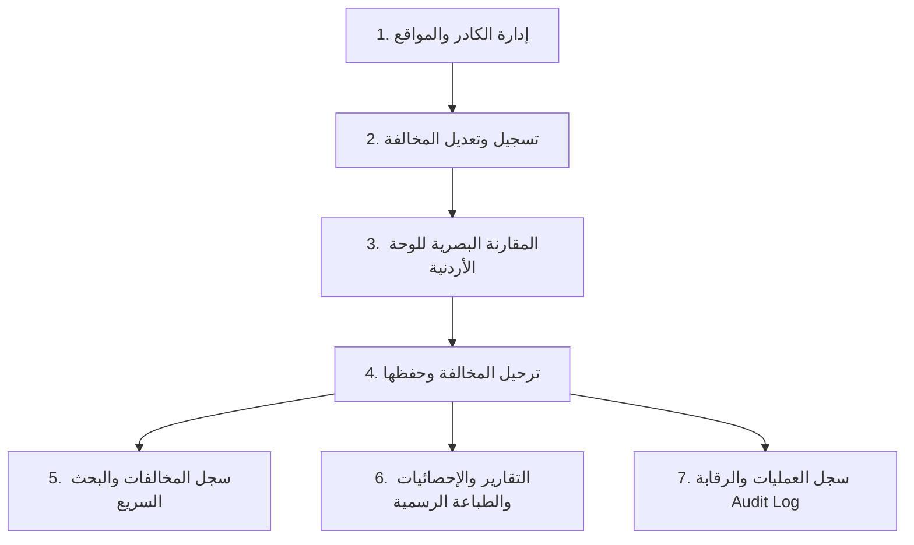

# 🏛️ المملكة الأردنية الهاشمية — أمانة عمّان الكبرى
## مديرية الرقابة الآلية والتحكم — قسم المخالفات
### المنظومة الشاملة لإدارة وتدقيق وتعديل مخالفات الكاميرات الرقابية (Camera Violations Management System)

---

---

## 📌 1. نبذة عن المنظومة والهدف المؤسسي

تم تصميم وتطوير هذه المنظومة الرقمية المتقدمة خصيصاً لتلبية متطلبات **مديرية الرقابة الآلية والتحكم (قسم المخالفات) في أمانة عمّان الكبرى**. يهدف النظام إلى استبدال كشوفات Excel اليدوية المعرضة للتلف أو أخطاء الإدخال بمنظومة ويب مؤسسية متكاملة تتيح لعدة موظفين ومدققين العمل معاً في نفس الوقت، مع توثيق رقابي لكل حركة، ومطابقة بصرية دقيقة للوحات المركبات الأردنية، وحساب تلقائي للإحصائيات ونسب الأخطاء.

---

## 🔑 2. روابط الوصول وبيانات الدخول الرسمية

### 🌐 رابط الوصول المباشر عبر الإنترنت (شغال الآن):
👉 **[رابط النظام السحابي عبر Cloudflare](https://selection-dialog-productive-unless.trycloudflare.com)**  
*(يعمل من أي هاتف أو جهاز كمبيوتر مباشرة دون الحاجة لكلمات سر إضافية أو برامج خاصة)*

### 💻 رابط الوصول عبر الشبكة الداخلية لمكاتب أمانة عمّان (LAN / Wi-Fi):
👉 **`http://localhost:5000`** أو عبر الآي بي الداخلي (مثال: `http://192.168.1.X:5000`)

### 👥 حسابات الدخول المعتمدة:
| نوع الحساب | اسم المستخدم (Username) | كلمة المرور (Password) | الصلاحيات والمهام |
| :--- | :--- | :--- | :--- |
| **مدير قسم المخالفات** | `admin` | `admin123` | كامل الصلاحيات (تسجيل، تعديل، حذف، إدارة الموظفين والمواقع، التقارير، وسجل الرقابة) |
| **موظف الرقابة والتدقيق** | `user` | `user123` | تسجيل المخالفات، البحث، واستعراض الكشوفات والتقارير اليومية |

---

## 🚀 3. دليل الاستخدام التفصيلي خطوة بخطوة

---

### 1️⃣ الخطوة الأولى: إدارة كادر العمل ومواقع الكاميرات (البيانات الأساسية)
*قبل البدء بتسجيل المخالفات، يتوجه مدير القسم إلى صفحة **"إدارة الموظفين"** لضبط كادر الأمانة:*

1. **الأدوار الوظيفية الأربعة المعتمدة**:
   - **المستخرجون (Extractors)**: الموظفون المسؤولون عن استخراج بيانات المخالفات من كاميرات المراقبة.
   - **المدققون (Auditors)**: موظفو تدقيق صور المركبات والتأكد من صحة أرقام اللوحات.
   - **المعدلون (Modifiers)**: الموظفون المكلفون بتصحيح الأرقام الخاطئة وتعديلها نظامياً.
   - **المبلغون (Reporters)**: الموظفون المخولون بإرسال وتبليغ المخالفة المعدلة.
2. **مواقع كاميرات أمانة عمّان**:
   - تسجيل أسماء الشوارع والتقاطعات الحقيقية (مثل: *شارع الأردن - دوار الاستقلال، شارع مكة - تقاطع الحرمين، شارع زهران - إشارات الدوار الثامن، طريق المطار - جسر مادبا...*).
3. **⚡ ميزة اللصق السريع المتعدد من Excel (Bulk Import)**:
   - بدلاً من إدخال الموظفين فرداً فرداً، اضغط على زر **`📋 لصق واستيراد سريع من Excel`**.
   - انسخ عمودي الرقم والاسم مباشرة من شيت الـ Excel والصقها في المربع (يدعم التعرف التلقائي على الفواصل والـ Tabs).
   - ستظهر لك معاينة حية فورية بالجدول. اضغط **"حفظ وإدراج الكل"** لتسجيل عشرات الموظفين بثانية واحدة!

---

### 2️⃣ الخطوة الثانية: تسجيل وتعديل المخالفات (شاشة الإدخال والترحيل الذكية)
*تضم شاشة الإدخال 15 حقلاً تم ترتيبها هندسياً لتقليل وقت الإدخال بنسبة 70%:*

1. **التحقق اللحظي التلقائي (Live Duplicate Check)**:
   - بمجرد كتابة رقم المخالفة، يتحقق النظام فوراً من قاعدة البيانات وينبهك إذا كان الرقم مسجلاً مسبقاً لمنع أي تكرار.
2. **التعبئة التلقائية الذكية**:
   - عند اختيار **تاريخ الإدخال**، يملأ النظام اسم اليوم بالعربية تلقائياً (مثلاً: *الأحد، الإثنين...*).
   - عند اختيار رقم أي موظف (مستخرج، مدقق، معدل، مبلغ)، يظهر اسمه الكامل الحقيقي في حقل القراءة فوراً وبشكل تلقائي.
3. **🇯🇴 محاكي اللوحات الأردنية الواقعي (Jordanian Plate Visualizer)**:
   - بمجرد إدخال رقم اللوحة الخاطئ ورقم اللوحة الصحيح، يرسم النظام **لوحتين متطابقتين للوحة المركبات الأردنية الرسمية** (مستطيل أبيض، كود المحافظة، كلمة الأردن، ورقم المركبة).
4. **🔍 المقارن البصري الذكي (Plate Diff Highlighter)**:
   - يبرز النظام تلقائياً وبشكل مرئي الأحرف والأرقام التي تم تعديلها:
     - الأرقام الخاطئة باللون الأحمر المشطوب.
     - الأرقام المصححة باللون الأخضر المضاء.
5. **📸 إرفاق صورة الكاميرا والمعاينة التفاعلية**:
   - يمكنك رفع لقطة كاميرا المخالفة أو سحبها وإفلاتها مباشرة.
   - ميزة تكبير الصورة (Zoom In/Out) لمعاينة تفاصيل لوحة المركبة والتأكد منها بدقة متناهية داخل النظام.
6. **زر "ترحيل المعلومات"**:
   - يقوم بحفظ السجل دفعة واحدة، وتفريغ النموذج لتجهيز المخالفة التالية، مع تنبيه نجاح أخضر واضح.

---

### 3️⃣ الخطوة الثالثة: سجل المخالفات الشامل وتصدير Excel
*الصفحة المخصصة للبحث والاستعلام الشامل عن كل العمليات:*

- **محرك بحث فوري متعدد المعايير**: ابحث برقم المخالفة، أو رقم اللوحة (الصحيح أو الخاطئ)، أو اسم أي موظف، أو موقع الكاميرا.
- **تصفية متقدمة**: تصفية حسب التاريخ (من - إلى) أو حسب طبيعة الخطأ (*خطأ قراءة كاميرا، لوحة غير واضحة، التباس أحرف...*).
- **تصدير فوري لملفات Excel (.xlsx / CSV)**: بنقرة زر واحدة يتم تنزيل كشف المخالفات المصفى والجاهز للطباعة أو الأرشفة الرسمية.
- **تعديل وحذف آمن**: إمكانية تعديل بيانات أي مخالفة مسجلة أو حذفها (مع توثيق سبب الحذف في سجل الرقابة).

---

### 4️⃣ الخطوة الرابعة: شيتات الأدوار التخصصية (Performance Sheets)
*صفحات منفصلة مخصصة لكل قسم وظيفي:*

- شيت خاص لـ **المستخرجين**، وآخر لـ **المدققين**، و **المعدلين**، و **المبلغين**.
- إمكانية استخراج **كشف فردي لموظف محدد** لعرض جميع المخالفات التي قام بمعالجتها مع مجموعها ونسبتها.

---

### 5️⃣ الخطوة الخامسة: لوحة التقارير والإحصائيات والطباعة الرسمية (Executive Reports)
*لوحة معلومات تنفيذية تدعم متخذي القرار في أمانة عمّان الكبرى:*

1. **فلاتر زمنية دقيقة**: (اليوم، الأسبوع، الشهر الحالي، الربع سنوي، نصف سنوي، السنوي، ومدى مخصص بالتاريخ).
2. **بطاقات المؤشرات القياسية (KPI Cards)**:
   - إجمالي المخالفات المعدلة.
   - نسبة نجاح التدقيق والتصحيح.
   - متوسط المخالفات اليومية.
3. **رسوم بيانية تفاعلية (Recharts)**:
   - رسم بياني يقارن حجم الإنجاز بين الفرق المختلفة.
   - رسم بياني يوضح **أكثر كاميرات أمانة عمّان تسجيلاً لأخطاء القراءة** لتحديد الكاميرات التي تحتاج إلى صيانة أو إعادة ضبط زوايا.
4. **🖨️ الترويسة والطباعة الرسمية (Official GAM Print Template)**:
   - عند الضغط على زر **"طباعة التقرير"**، ينسق النظام الصفحة تلقائياً بمقاس A4 الرسمي مع:
     - ترويسة أمانة عمّان الكبرى وشعار المملكة الأردنية الهاشمية.
     - تاريخ وساعة استخراج التقرير واسم المستخرج.
     - مساحات معتمدة لتوقيع مدقق الرقابة ورئيس قسم المخالفات ومدير مديرية الرقابة الآلية.

---

### 6️⃣ الخطوة السادسة: سجل العمليات والرقابة الإدارية (Audit Trail)
*شاشة رقابية لا يمكن التلاعب بها لضمان أعلى درجات النزاهة والشفافية:*

- تسجل المنظومة تلقائياً كل حركة تتم داخل النظام:
  - من قام بإدخال المخالفة الفلانية ومتى بالتاريخ والثانية؟
  - من قام بتعديل لوحة معينة وما هي القيمة السابقة والجديدة؟
  - من أضاف أو عطل موظفاً؟
- إمكانية تصدير سجل الرقابة لتقديمه للإدارة العليا ولجان التدقيق الداخلي.

---

## 🛡️ 4. قواعد البيانات وأمان البيانات الحقيقية

- **قاعدة بيانات مستقلة 100% (SQLite via better-sqlite3)**:
  - البيانات مخزنة في ملف حقيقي مستقل: `server/src/config/database.sqlite`.
  - لا توجد أي بيانات وهمية أو افتراضية؛ النظام يبدأ نظيفاً 100% وجاهزاً لبياناتكم الفعلية.
  - تعمل بتقنية **WAL Mode (Write-Ahead Logging)** لتمكين القراءة والكتابة المتزامنة لعشرات الموظفين في نفس اللحظة دون أي تعليق أو بطء.
- **نظام الحذف الآمن (Soft Delete)**:
  - عند حذف موظف لديه مخالفات سابقة، لا يتم مسح اسمه من السجلات التاريخية لحماية محاضر المخالفات، بل يتم إخفاؤه فقط من قوائم الإدخال الجديدة.

---

## 💻 5. كيفية تشغيل ومشاركة المنظومة

تم تجهيز أدوات تشغيل بنقرة واحدة داخل المجلد الرئيسي:

| الملف | الوظيفة | متى تستخدمه؟ |
| :--- | :--- | :--- |
| **`تشغيل_النظام.bat`** | يشغل السيرفر المحلي ويفتح المتصفح فوراً على `http://localhost:5000` | للاستخدام اليومي المباشر على جهازك الشخصي |
| **`رابط_المشاركة_المباشر_Cloudflare.bat`** | يولد رابط إنترنت عاماً وفورياً ومحمياً بشهادة SSL | لمشاركة النظام فوراً مع أي زميل عبر WhatsApp أو الإيميل |
| **`مشاركة_الشبكة_المحلية.bat`** | يكتشف آي بي جهازك على شبكة الأمانة لمشاركته مع الزملاء المتصلين بنفس الـ Wi-Fi | داخل مكاتب قسم المخالفات بأمانة عمّان |

---

## 🏢 الهوية المؤسسية
- **الجهة**: أمانة عمّان الكبرى (Greater Amman Municipality - GAM)
- **المديرية**: مديرية الرقابة الآلية والتحكم
- **القسم**: قسم كشف وتعديل مخالفات الكاميرات
- **الدولة**: المملكة الأردنية الهاشمية 🇯🇴
